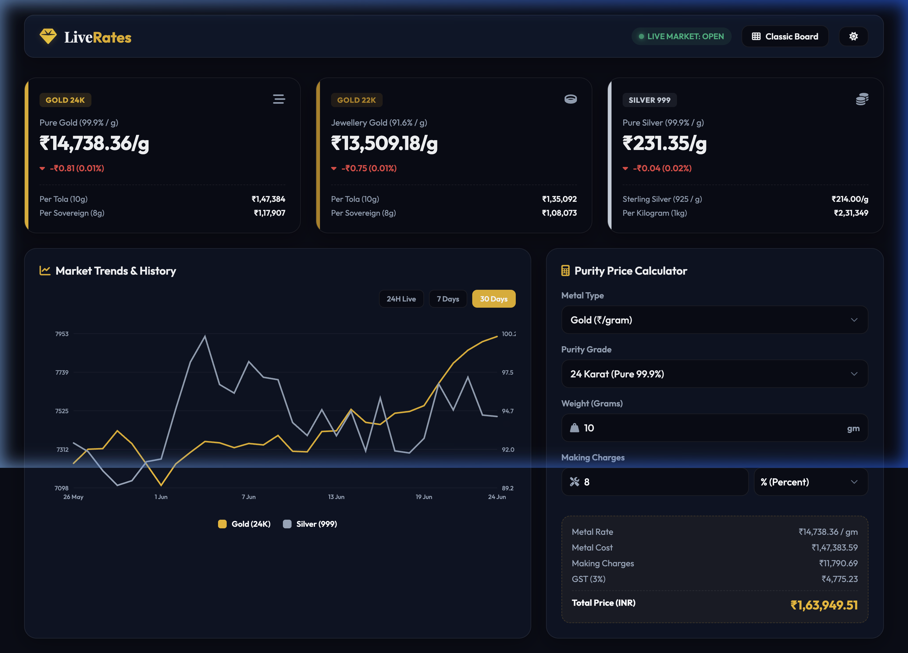
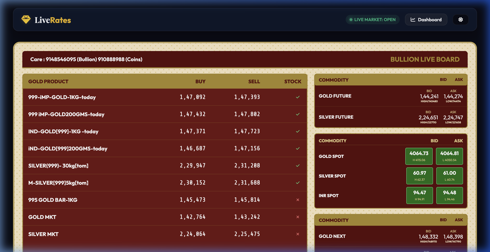

# 📈 Live Gold & Silver Price Tracker (INR)

A stunning, real-time Progressive Web App (PWA) and hybrid mobile application to track daily Gold and Silver prices in Indian Rupees (INR). Fully responsive, featuring a dual-mode layout that toggles between a **Premium Consumer Dashboard** and a **Classic Bullion Billboard** trading screen.

---

## 📸 Screenshots

### 1. Modern Glassmorphism Dashboard
A sleek, modern interface with interactive SVG line charts and a purity-based GST/making charge calculator.



### 2. Classic Bullion Billboard View
Matches the traditional, high-contrast tan-and-maroon trading desk billboard design with real-time buy/sell commodity contracts.



---

## 🌟 Key Features

- **⚡ Live Accurate Pricing**: Automatically connects to free, CORS-enabled endpoints (`gold-api.com` and `open.er-api.com`) to query international spot rates and USD/INR exchange rates, converting them with local Indian bullion market duties (18.8% premium for Gold, 23.8% premium for Silver).
- **🎛️ Dual UI Theme & Layout**:
  - **Dashboard View**: Clean, modern glassmorphism dark/light UI cards showing per gram, tola (10g), and sovereign (8g) rates.
  - **Billboard View**: High-contrast, large-font trading bulletin layout displaying spot/futures bid and ask prices.
- **🧮 Indian Purity Calculator**: Computes Metal Cost + Making Charges (Percentage or Fixed) + 3% Indian GST = Final total receipt.
- **📊 Interactive SVG Charts**: Lightweight, custom-drawn SVG charts for 24H Live, 7 Days, and 30 Days histories, complete with crosshair hover tracking tooltips.
- **📲 Progressive Web App (PWA)**: Caches assets locally via `sw.js` for offline functionality; fully installable on iOS, Android, and Desktop directly from the browser.
- **📱 Mobile App Ready**: Configured with **Capacitor** to build native project files for iOS (Xcode) and Android (Android Studio).

---

## 🛠️ Tech Stack

- **Frontend**: HTML5, Vanilla JavaScript, CSS3 Grid/Flexbox
- **APIs**: [Gold-API](https://gold-api.com/) & [Open Exchange Rates](https://open.er-api.com/)
- **Mobile Framework**: Ionic Capacitor Core & CLI
- **PWA Service Worker**: Custom Cache Storage API caching local static resources

---

## 🚀 Getting Started

### Prerequisites
Make sure you have [Node.js](https://nodejs.org/) installed.

### Local Development Installation
1. Clone the repository:
   ```bash
   git clone https://github.com/rathanshet/goldsilverlive.git
   cd goldsilverlive
   ```
2. Install Capacitor packages:
   ```bash
   npm install
   ```
3. Run a local development server:
   ```bash
   # Using Python's built-in server
   cd www && python3 -m http.server 8000
   ```
   Open **[http://localhost:8000](http://localhost:8000)** in your browser.

---

## 📱 Mobile App Compilation Guide

Every time you modify the files inside the `/www` folder, you must sync changes to the native build directories:
```bash
npx cap sync
```

### Compile for Android (Google Play Store)
1. Open the `/android` folder in **Android Studio**.
2. Wait for Gradle sync to complete.
3. Select **Build > Generate Signed Bundle / APK** to generate a release-ready package.

### Compile for iOS (Apple App Store)
1. Open the project in **Xcode**:
   ```bash
   npx cap open ios
   ```
2. In Xcode, configure your developer account signature under Signing & Capabilities.
3. Select **Product > Archive** and distribute the app to App Store Connect.

---

## 📃 License
This project is open-source and available under the [ISC License](LICENSE).
